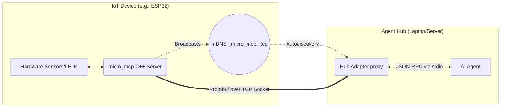

# micro_mcp 🚀

`micro_mcp` is an extremely lightweight, memory-efficient C++ implementation of the **Model Context Protocol (MCP)** specifically designed for IoT devices and microcontrollers (like ESP32, Arduino, and Pico). 

It allows your local AI agents (e.g., Claude Desktop or custom agents) to seamlessly discover, read sensors from, and actuate your IoT devices over a local network.

---

## 🏗️ Architecture & Visual Connection

Because standard MCP relies on parsing bulky JSON strings over `stdio`, it can quickly exhaust the RAM of a tiny microcontroller. 

To solve this, `micro_mcp` uses **Protocol Buffers** to send highly compressed binary messages over a TCP socket. A lightweight Python **Hub Adapter** runs on your Agent Hub (your laptop or server) to automatically translate these binary messages back into standard JSON-RPC MCP that your AI agents understand.



---

## 🛠️ Features

- **Abstract Transports:** Pure virtual `Transport` interface so you can run it over Wi-Fi (TCP), Serial, or MQTT.
- **Zero JSON Parsing:** All serialization is done via statically allocated Protocol Buffers (`nanopb`), keeping memory usage tiny and predictable.
- **Automatic Network Discovery:** Built-in mDNS support means your Hub Adapter automatically finds devices on the network.
- **Full MCP Support:** Expose both **Tools** (actuators) and **Resources** (sensors).

---

## 🚀 Getting Started

### 1. Flash the IoT Device (C++)

Include the library in your C++ project. Here is how easy it is to expose a smart bulb to an AI agent:

```cpp
#include <micro_mcp/server.h>
#include <micro_mcp/transport/posix_tcp_transport.h>
#include <ESPmDNS.h> // Example for ESP32

using namespace micro_mcp;

bool led_state = false;

// 1. Define your hardware function
std::string toggle_led(const std::string& args_json) {
    led_state = !led_state;
    digitalWrite(LED_PIN, led_state ? HIGH : LOW);
    return "{\"status\": \"success\"}";
}

void setup() {
    // ... connect to WiFi ...

    // 2. Broadcast the device to the network
    MDNS.begin("smart-bulb");
    MDNS.addService("micro_mcp", "tcp", 5000);

    // 3. Start the Server and register tools
    static Server server("smart-bulb", "1.0.0");
    static PosixTcpTransport transport(5000);
    
    transport.begin();
    server.set_transport(&transport);

    server.register_tool(
        "toggle_led", 
        "Toggles the smart bulb on or off", 
        "{\"type\": \"object\", \"properties\": {}}", 
        toggle_led
    );
}

void loop() {
    server.poll(); // Keep the MCP connection alive
}
```

### 2. Run the Hub Adapter

On your local machine (where your AI agent lives), install the requirements for the bridge:

```bash
cd hub_adapter
pip install grpcio-tools protobuf zeroconf
```

### 3. Connect your AI Agent

Configure your AI Agent (like Claude Desktop) to use the Hub Adapter. 

If your IoT device is broadcasting mDNS (as shown in the code above), you don't even need to provide an IP address. Just run the adapter!

**`claude_desktop_config.json`:**
```json
{
  "mcpServers": {
    "iot-bulb": {
      "command": "python3",
      "args": [
        "/path/to/micro_mcp/hub_adapter/adapter.py"
      ]
    }
  }
}
```

If you aren't using mDNS, you can easily hardcode the IP and port:
```json
      "args": [
        "/path/to/micro_mcp/hub_adapter/adapter.py",
        "192.168.1.100",
        "5000"
      ]
```

### 4. Try it Manually (Example Deployment)

If you want to manually test the end-to-end connection between an IoT device and your Hub, you can run the simulated `example_device` and talk to it via the terminal.

1. **Install Dependencies (on the IoT Device / Linux machine)**:
   Ensure you have CMake, build tools, and the Protocol Buffer compiler installed:
   ```bash
   sudo apt-get update
   sudo apt-get install -y cmake build-essential protobuf-compiler
   ```

2. **Start the IoT Device**:
   Clone the repo, build it, and run the example:
   ```bash
   mkdir build && cd build
   cmake .. && make
   ./example_device
   ```
   *(The device is now running and listening on port 5000).*

3. **Run the Hub Adapter and Talk to It**:
   On your local machine, run the Hub Adapter and connect to your device's IP address:
   ```bash
   python3 hub_adapter/adapter.py 192.168.1.133 5000
   ```
   The terminal will wait for your standard input. Paste this standard MCP JSON-RPC request and hit Enter:
   ```json
   {"jsonrpc": "2.0", "id": 1, "method": "initialize", "params": {"protocolVersion": "2024-11-05", "capabilities": {}, "clientInfo": {"name": "ManualTest", "version": "1.0"}}}
   ```
   *You will instantly see the binary protobuf response from the C++ device converted back into JSON and printed to your screen!*

### 5. Automated Deployment & Testing (Raspberry Pi)

For rapid iteration on Linux-based IoT devices like a Raspberry Pi, we have included automated Python scripts to seamlessly deploy and test your device over SSH.

1. **Setup the Deployment Script**:
   Open `deploy.py` and modify the top variables to match your Raspberry Pi's credentials:
   ```python
   host = "192.168.1.133"
   user = "pi"
   password = "yourpassword"
   ```

2. **Deploy the Code**:
   On your local machine, simply run:
   ```bash
   pip install paramiko scp
   python3 deploy.py
   ```
   *This script automatically compresses the local codebase, transfers it over SSH, installs required dependencies (`cmake`, `protobuf-compiler`), compiles the C++ codebase via nanopb, and starts the `example_device` simulator securely in the background.*

3. **Run the Automated Hub Simulator**:
   Ensure you update the IP address inside `test_hub.py` to match your Raspberry Pi. Then, execute the test script on your local machine:
   ```bash
   python3 test_hub.py
   ```
   *The script automatically spawns the Hub Adapter, connects via Wi-Fi to your IoT device, performs an MCP initialization handshake, queries the available tools, and prints the raw JSON response!*

---

## 📁 Directory Layout

- `/proto/`: Contains `mcp.proto`, the binary specification of the Model Context Protocol.
- `/include/micro_mcp/`: The public C++ headers.
- `/src/`: The C++ implementations and generated nanopb serialization code.
- `/hub_adapter/`: The Python proxy that bridges the IoT device to your AI Agent.
- `/examples/`: Simulated examples of how to run the library.
