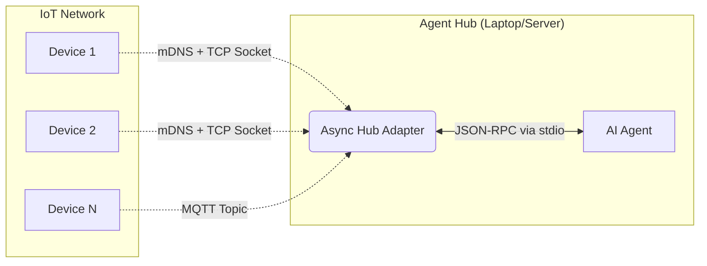

# micro_mcp 🚀

`micro_mcp` is an extremely lightweight, memory-efficient C++ implementation of the **Model Context Protocol (MCP)** specifically designed for IoT devices and microcontrollers (like ESP32, Arduino, and Pico). 

It allows your local AI agents (e.g., Claude Desktop or custom agents) to seamlessly discover, read sensors from, and actuate your IoT devices over a local network.

---

## 🏗️ Architecture & Massive Concurrency

Because standard MCP relies on parsing bulky JSON strings over `stdio`, it can quickly exhaust the RAM of a tiny microcontroller. To solve this, `micro_mcp` uses **Protocol Buffers** to send highly compressed binary messages. 

To bridge these devices to your AI agent, a highly concurrent Python **Hub Adapter** runs on your Agent Hub (your laptop or server). The Hub Adapter dynamically discovers hundreds of IoT devices, maintains active connections via `asyncio`, and aggregates all their tools and resources into a single standard JSON-RPC MCP endpoint that your AI agents understand.



---

## 🛠️ Features

- **Massive Scalability:** The Python Hub automatically routes and aggregates requests across hundreds of IoT devices simultaneously using `asyncio` and `zeroconf` (mDNS).
- **Abstract Transports:** Pure virtual `Transport` interface so you can run it over Wi-Fi (TCP), Serial, or MQTT. We provide `PosixTcpTransport` and `PosixMqttTransport` out of the box!
- **Zero JSON Parsing:** All serialization is done via statically allocated Protocol Buffers (`nanopb`), keeping memory usage tiny and predictable on the C++ side.
- **MCP Aggregation:** The AI Agent sees the Hub as a *single* MCP Server, but gets access to the tools and resources of every connected device!

---

## 🚀 Getting Started

### 1. Run the Hub Adapter

On your local machine (where your AI agent lives), install the asyncio dependencies for the bridge:

```bash
cd hub_adapter
pip install grpcio-tools protobuf zeroconf paho-mqtt
```

Choose the adapter that matches your infrastructure:

- **TCP Adapter (`tcp_adapter.py`)**: Best for standard Wi-Fi setups. Automatically discovers `micro_mcp` devices broadcasting mDNS on your local network and opens asynchronous TCP sockets.
- **MQTT Adapter (`mqtt_adapter.py`)**: Best for massive IoT scale. Connects to an MQTT broker (like Mosquitto) and subscribes to the `mcp/+/tx` topic, requiring no direct network connections to the devices.

### 2. Connect your AI Agent

Configure your AI Agent (like Claude Desktop or Antigravity) to use the Hub Adapter.

**Antigravity (`mcp_config.json`) / Claude Desktop (`claude_desktop_config.json`):**
```json
{
  "mcpServers": {
    "iot-hub": {
      "command": "python3",
      "args": [
        "/path/to/micro_mcp/hub_adapter/mqtt_adapter.py",
        "192.168.1.133",
        "1883"
      ]
    }
  }
}
```

*Note on Dynamic Tools:* Because IoT networks are highly dynamic, the Hub Adapter utilizes MCP's `notifications/tools/list_changed` JSON-RPC event. When the Hub adapter boots, it fires a massive global ping to `mcp/broadcast/rx`. As the microcontrollers wake up and reply, the Hub dynamically injects their tools into your AI Agent in real-time!

### 3. Flash the IoT Device (C++)

Include the library in your C++ project. Here is how easy it is to expose a smart bulb to an AI agent over MQTT:

```cpp
#include <micro_mcp/server.h>
#include <micro_mcp/transport/posix_mqtt_transport.h>

using namespace micro_mcp;

bool led_state = false;

// 1. Define your hardware function
std::string toggle_led(const std::string& args_json) {
    led_state = !led_state;
    return "{\"status\": \"success\"}";
}

int main(int argc, char* argv[]) {
    std::string device_name = (argc > 1) ? argv[1] : "smart-bulb";

    // 2. Start the Server and register tools
    static Server server(device_name, "1.0.0");
    
    // Use the MQTT Transport connecting to your local broker
    static PosixMqttTransport transport(device_name, "192.168.1.133", 1883);
    
    transport.begin();
    server.set_transport(&transport);

    server.register_tool(
        "toggle_led", 
        "Toggles the smart bulb on or off", 
        "{\"type\": \"object\", \"properties\": {}}", 
        toggle_led
    );

    while (true) {
        server.poll(); // Automatically handles broadcast pings and MCP protocol
    }
}
```

### 4. Automated Deployment & Testing (Raspberry Pi)

For rapid iteration on Linux-based IoT devices like a Raspberry Pi, we have included automated Python scripts to seamlessly deploy and test your entire fleet over SSH.

1. **Deploy a Massive Fleet**:
   On your local machine, you must provide your Raspberry Pi's SSH credentials via CLI arguments or environment variables (`MICRO_MCP_HOST`, `MICRO_MCP_USER`, `MICRO_MCP_PASSWORD`):
   ```bash
   pip install paramiko scp
   python3 deploy.py --mqtt --host 192.168.1.133 --user vidya --password yourpassword
   ```
   *This automatically installs `libmosquitto-dev` on the Pi, compiles the C++ server, and simultaneously spawns 5 separate background IoT daemons (`livingroom-light`, `kitchen-thermostat`, etc.) to prove the massive concurrency capabilities of the Hub Adapter.*

---

## 📁 Directory Layout

- `/proto/`: Contains `mcp.proto`, the binary specification of the Model Context Protocol.
- `/include/micro_mcp/`: The public C++ headers.
- `/src/`: The C++ implementations, Transports (TCP/MQTT), and generated nanopb code.
- `/hub_adapter/`: The Python asyncio proxies (`tcp_adapter.py`, `mqtt_adapter.py`, `mcp_aggregator.py`).
- `/examples/`: Simulated examples of how to run the library.
